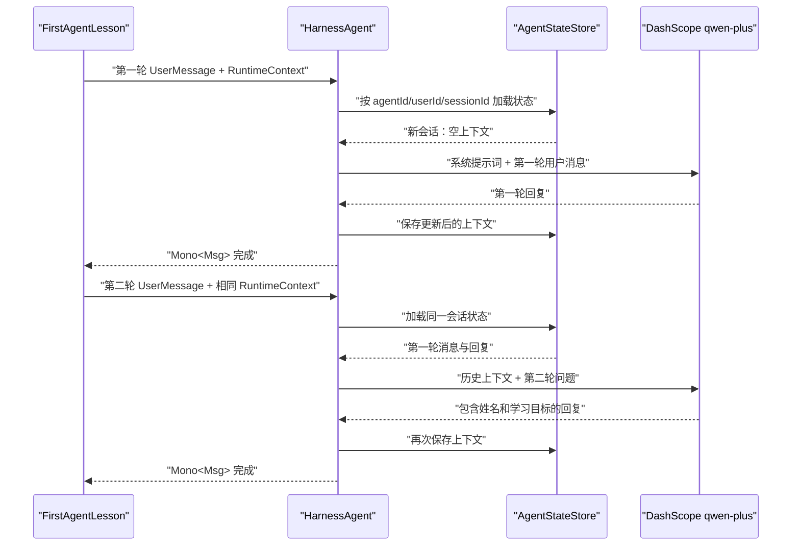

# 第 1 课：创建第一个 HarnessAgent

> 对应代码：[`FirstAgentLesson.java`](../../src/main/java/com/example/agentscopedemo/lesson01/FirstAgentLesson.java)

## 1. 学习目标

完成本课后，你应该能够：

- 说明 `HarnessAgent` 在 AgentScope Java 2.0 中的作用。
- 使用字符串模型 ID 配置 DashScope 模型。
- 使用 `UserMessage` 向 Agent 发送消息，并从 `Msg` 读取回复。
- 理解 `RuntimeContext` 中 `userId` 和 `sessionId` 的用途。
- 解释为什么第二轮对话可以使用第一轮的信息。
- 区分 Workspace 和 AgentState 状态存储。
- 初步理解 `Mono<Msg>` 和 `.block()` 的关系。

## 2. 前置知识与环境

本课只要求掌握基础 Java：类、`main` 方法、局部变量、方法调用和异常。

运行环境：

- JDK 21。AgentScope Java 2.0 官方最低要求是 JDK 17。
- Maven 3.9.16。
- IntelliJ IDEA。
- 一个可用的 DashScope API Key。

API Key 只通过环境变量传入，不能写入 Java 源码、`application.properties` 或 Git 仓库。

## 3. 本课文件与依赖

### 3.1 Java 入口类

本课故意使用独立的 `main` 方法，而没有立即接入 Spring Boot。这样可以先看清 AgentScope 自身的对象和调用过程。第 4 课再把同一能力封装成 REST API。

入口类的完全限定名为：

```text
com.example.agentscopedemo.lesson01.FirstAgentLesson
```

### 3.2 Maven 依赖

项目在 `pom.xml` 中使用统一版本属性：

```xml
<agentscope.version>2.0.1</agentscope.version>
```

本课直接使用两个 AgentScope 模块：

```xml
<dependency>
    <groupId>io.agentscope</groupId>
    <artifactId>agentscope-harness</artifactId>
    <version>${agentscope.version}</version>
</dependency>

<dependency>
    <groupId>io.agentscope</groupId>
    <artifactId>agentscope-extensions-model-dashscope</artifactId>
    <version>${agentscope.version}</version>
</dependency>
```

它们的职责不同：

- `agentscope-harness` 提供 `HarnessAgent`，并传递依赖 AgentScope 核心模块。
- `agentscope-extensions-model-dashscope` 提供 DashScope 模型实现，并把 `dashscope:<model>` 注册到 `ModelRegistry`。

如果缺少第二个依赖，代码仍可能认识 `HarnessAgent`，但运行时无法解析 `dashscope:qwen-plus` 这个模型 ID。

## 4. 核心心智模型

### 4.1 Agent 不只是一次模型请求

直接调用大模型 API，通常是“提交消息，获得回复”。Agent 在模型调用之外还要处理工具、上下文、状态、权限和执行循环。

AgentScope Java 2.0 提供两层常用 Agent：

- `ReActAgent` 是核心推理与行动循环，负责“推理 → 调用工具 → 继续推理 → 最终回复”。
- `HarnessAgent` 在这套核心循环上增加 Workspace、状态持久化、记忆压缩、Skills、子 Agent 和沙箱等工程能力。

本课程从 `HarnessAgent` 开始，是因为它能在一个很小的例子里展示 AgentScope 2.0 最重要的工程概念：同一个 Agent 实例可以服务不同用户和会话，而每次调用的状态由运行上下文定位。

### 4.2 第二轮为什么记得第一轮

不要把它理解成 `HarnessAgent` 对象里有一个只属于“小明”的 Java 字段。

真正的过程是：

1. 调用时传入 `userId=student` 和 `sessionId=lesson-01`。
2. AgentScope 使用这两个 ID 定位该会话的 `AgentState`。
3. 第一轮消息和回复进入会话上下文，并在调用结束时保存。
4. 第二轮使用相同 ID，框架会加载同一份上下文。
5. 模型看到第一轮内容，因此能回答姓名和学习目标。

所以，会话状态的逻辑主键可以先记成：

```text
(agentId, userId, sessionId)
```

本课对应的是：

```text
(learning-assistant, student, lesson-01)
```

## 5. 代码逐段解析

### 5.1 import：本课使用了哪些类型

```java
import io.agentscope.core.agent.RuntimeContext;
import io.agentscope.core.message.Msg;
import io.agentscope.core.message.UserMessage;
import io.agentscope.harness.agent.HarnessAgent;
import io.agentscope.harness.agent.memory.compaction.CompactionConfig;
```

- `RuntimeContext`：描述“这一次调用属于谁、属于哪个会话”。它是 per-call 信息，不是全局配置。
- `Msg`：AgentScope 的通用消息抽象。Agent 最终回复使用该类型返回。
- `UserMessage`：角色明确为用户的输入消息。
- `HarnessAgent`：本课创建的 Agent 类型。
- `CompactionConfig`：上下文压缩策略配置。

```java
import java.nio.file.Paths;
```

`Paths` 是 JDK 自带 API，用来表示本地工作区路径。

### 5.2 启动前检查 API Key

```java
requireEnvironmentVariable("DASHSCOPE_API_KEY");
```

这不是 AgentScope 的强制写法，而是本项目为了让错误更容易理解而增加的保护。

如果不提前检查，程序可能直到首次模型调用时才出现认证或模型初始化错误。现在缺少环境变量时会立即提示：

```text
缺少环境变量 DASHSCOPE_API_KEY，请先配置 DashScope API Key 再运行本课。
```

### 5.3 构建 HarnessAgent

```java
HarnessAgent agent = HarnessAgent.builder()
        .name("learning-assistant")
        .sysPrompt("你是一位耐心的 AgentScope Java 学习助手，请用简洁的中文回答。")
        .model("dashscope:qwen-plus")
        .workspace(Paths.get(".agentscope/workspace"))
        .compaction(CompactionConfig.builder()
                .triggerMessages(30)
                .keepMessages(10)
                .build())
        .build();
```

逐项解释：

#### `name("learning-assistant")`

这是 Agent 的稳定标识，不只是展示名称。它还参与默认状态目录的组织，因此不要在同一学习实验中随意修改后又期待读取旧状态。

#### `sysPrompt(...)`

系统提示词定义 Agent 的基础角色和回答风格。它的优先级高于普通用户消息，但不能保证模型的自然语言输出逐字固定。

#### `model("dashscope:qwen-plus")`

字符串格式是：

```text
提供商:模型名
```

`ModelRegistry` 看到 `dashscope` 后，会寻找 DashScope 模型扩展，并自动读取 `DASHSCOPE_API_KEY`。这种写法适合快速开始。

以后需要自定义 endpoint、超时或模型参数时，可以显式使用 `DashScopeChatModel.builder()` 创建模型对象。

#### `workspace(Paths.get(".agentscope/workspace"))`

Workspace 是 Agent 可使用的工作环境。后续课程会在里面加入：

- `AGENTS.md`：人格和项目指令。
- `MEMORY.md`：整理后的长期记忆。
- `skills/`：可按需加载的技能。
- `subagents/`：子 Agent 声明。

这里使用相对路径，因此实际位置是项目根目录下的 `.agentscope/workspace`。

#### `compaction(...)`

```java
.triggerMessages(30)
.keepMessages(10)
```

含义是消息数量达到阈值后触发上下文压缩，并保留一定数量的近期消息。当前例子只有两轮，不会触发压缩；提前写上配置是为了让 Builder 的工程结构保持完整。第 6 课会专门验证压缩和长期记忆。

#### `.build()`

Builder 收集配置并创建 Agent。通常一个长生命周期应用只创建一个 Agent 实例，然后通过不同 `RuntimeContext` 服务多个用户与会话。

### 5.4 创建 RuntimeContext

```java
RuntimeContext context = RuntimeContext.builder()
        .userId("student")
        .sessionId("lesson-01")
        .build();
```

- `userId` 用于隔离不同用户。
- `sessionId` 用于隔离同一用户的不同会话。

两者都应该是业务系统中的稳定 ID，不建议直接使用会变化的昵称。

### 5.5 第一轮调用

```java
Msg firstReply = agent.call(
        new UserMessage("我叫小明，正在学习 AgentScope Java 2.0。"),
        context
).block();
printReply("第一轮", firstReply);
```

这段代码包含四步：

1. 创建 `UserMessage`。
2. 把消息和 `RuntimeContext` 一起传给 Agent。
3. `agent.call(...)` 执行 Agent 循环，返回 `Mono<Msg>`。
4. `.block()` 等待异步流程结束，取得普通的 `Msg`。

AgentScope 基于 Project Reactor。`Mono<Msg>` 可以理解成“未来最多产生一个 `Msg` 的异步计算”。控制台入门程序使用 `.block()` 最容易理解；在真正的响应式 Web 请求线程中随意阻塞可能降低并发能力，后面的 REST 课程会采用更合适的返回方式。

#### 什么是 Project Reactor

Project Reactor 是 JVM 上的响应式编程库，也是 Spring 响应式技术栈的基础之一。它实现了 Reactive Streams 规范，并提供两种最常见的响应式类型：

| 类型 | 可能产生的数据数量 | 适合的场景 |
| --- | --- | --- |
| `Mono<T>` | 0 或 1 个 | 一次 HTTP 响应、查询一个对象、一次 Agent 最终回复 |
| `Flux<T>` | 0 到 N 个 | 多条数据库记录、连续事件、Agent 流式输出 |

“0 个”不是异常。例如一个 `Mono<Void>` 不提供业务数据，只表达“这个异步任务最终完成或失败”。

Reactor 的价值不是单纯把回调换成链式写法，而是用统一方式表达：

- 数据什么时候产生。
- 数据产生后如何转换。
- 中间步骤发生错误时如何处理。
- 如何取消尚未完成的任务。
- 下游处理速度较慢时，如何控制上游生产速度。
- 整条异步流程最终完成、失败还是保持运行。

#### Reactive Streams 中的四个角色

理解 Reactor 时可以先认识四个核心角色：

```text
Publisher  --发布数据-->  Subscriber
     ^                         |
     |------- Subscription ----|
                  |
               request(n) / cancel()
```

- `Publisher`：数据发布者。`Mono` 和 `Flux` 都实现了 Publisher。
- `Subscriber`：订阅者，接收数据、完成或错误信号。
- `Subscription`：一次具体的订阅关系，可以请求数据或取消执行。
- `Processor`：同时具有发布者和订阅者能力的中间角色；日常业务更多直接使用 Reactor operator，而不是自己实现它。

Subscriber 可以收到三类主要信号：

```text
onNext(value)     产生一个值
onComplete()      正常结束
onError(error)    异常结束
```

对于 `Mono<Msg>`，合法结果通常只有下面三种：

1. `onNext(msg)`，随后 `onComplete()`。
2. 没有 `onNext`，直接 `onComplete()`，表示空结果。
3. `onError(error)`，表示失败，不会再发送完成信号。

#### Mono 是“执行结果的描述”，不是已经得到的 Msg

看下面两行：

```java
Mono<Msg> replyMono = agent.call(new UserMessage("你好"), context);
Msg reply = replyMono.block();
```

第一行得到的不是回复本身，而是一条响应式执行链。可以把它理解成一张描述未来任务的“流程图”。Reactor 中大多数执行链具有惰性：只组装操作通常不会真正启动数据流，订阅才会触发执行。

订阅方式包括：

```java
replyMono.subscribe(reply -> System.out.println(reply.getTextContent()));
```

以及本课使用的：

```java
Msg reply = replyMono.block();
```

两者都会订阅，但调用线程的行为不同：

- `subscribe(...)` 通常立即把控制权还给调用者，结果就绪后执行回调。
- `block()` 订阅后让当前线程等待，直到拿到值、空完成或发生异常。

还要注意，每次调用 `block()` 都会创建一次新的订阅。对冷 Publisher 来说，新订阅通常意味着执行链重新运行，所以不要把同一个会发起远程请求的 `Mono` 随意 `block()` 多次。

#### 异步、非阻塞和多线程不是同一个概念

这三个词需要分开理解：

- **异步**：调用者不要求在当前调用栈里立刻拿到最终结果，可以在结果就绪后继续处理。
- **非阻塞**：等待网络或其他资源时，不占住当前线程干等。
- **多线程/并行**：多个任务确实在不同线程或 CPU 核心上同时执行。

一个 `Mono` 不会因为名字是响应式类型就自动新建线程。Reactor 本身不强制并发模型；如果没有异步数据源或 Scheduler 切换，大多数 operator 会继续在发起订阅或上一个 operator 所在的线程执行。

Reactor 提供 `Scheduler` 来表达执行上下文。常见概念包括：

- `publishOn(scheduler)`：主要影响它之后的 operator 在哪里执行。
- `subscribeOn(scheduler)`：主要影响订阅和上游源从哪里开始执行。
- `Schedulers.parallel()`：适合短小、非阻塞、偏 CPU 的任务。
- `Schedulers.boundedElastic()`：为不得不调用的传统阻塞 API 提供有上限的工作线程资源。

本课不需要手动切换 Scheduler。AgentScope 已经返回响应式类型，调用方应该优先保持这条响应式链，而不是先阻塞再把它包装回异步任务。

#### 什么是背压

背压（backpressure）是下游向上游表达处理能力的机制。

假设上游每秒产生 10,000 个事件，而界面每秒只能处理 100 个。如果没有控制，事件会不断堆积并占用内存。Reactive Streams 允许 Subscriber 通过 `request(n)` 表示“我目前最多准备接收 n 个”，还可以通过 `cancel()` 停止订阅。

背压在 `Flux` 的连续事件场景最直观。`Mono` 最多只有一个值，压力问题不明显，但它仍遵循同一套规范。第二课使用 `streamEvents()` 获得 `Flux<AgentEvent>` 时，这个概念会更加重要。

#### block() 到底做了什么

本课代码：

```java
Msg firstReply = agent.call(message, context).block();
```

可以按顺序理解为：

1. `agent.call(...)` 组装一个最终会产生 `Msg` 的响应式流程。
2. `block()` 对它发起订阅。
3. AgentScope 开始加载状态、调用模型、处理可能的工具事件并保存状态。
4. 当前 `main` 线程在等待期间不能继续执行下一行。
5. 收到 `Msg` 后，`block()` 返回该对象。
6. 如果上游发出 `onError`，`block()` 会把异常抛给当前线程。
7. 如果 Mono 空完成，`block()` 可能返回 `null`，因此本课的 `printReply` 做了空值检查。

控制台程序只有一个主要任务：等待 Agent 回答，再打印结果。阻塞 `main` 线程简单直观，也不会占用一个需要服务大量请求的稀缺线程，所以此处使用 `block()` 是合理的。

生产代码通常还应该限制最长等待时间，例如：

```java
Msg reply = agent.call(message, context)
        .block(Duration.ofSeconds(60));
```

这仍然是阻塞调用，只是不会无限等待。响应式 Web 中更推荐使用 Reactor 的 `timeout` operator 并把 `Mono` 继续返回给框架。

#### 为什么响应式 Web 请求中不应该随意 block

在传统 Spring MVC Servlet 模型中，一个请求通常占用一个工作线程。LLM 调用可能持续数秒甚至数十秒，如果线程一直 `block()`，大量并发请求会快速占满线程池，后续请求只能排队。

在 Spring WebFlux + Reactor Netty 模型中，少量 event-loop 线程会轮流处理大量连接。event-loop 的思想是：发起网络 I/O 后先去处理其他连接，等数据就绪再回来继续。如果在 event-loop 上调用 `block()`：

```text
event-loop 线程
    ├── 本来可以处理请求 A、B、C、D
    └── 却被请求 A 的 block() 占住几十秒
```

结果不是只让 A 等待，而是可能拖慢共享该线程的许多连接。这就是“降低并发能力”的具体含义。

#### Web 层应该怎样写

假设以后使用 Spring WebFlux，Controller 不取出 `Msg`，而是继续返回 `Mono`：

```java
@PostMapping("/chat")
public Mono<ChatResponse> chat(@RequestBody ChatRequest request) {
    RuntimeContext context = RuntimeContext.builder()
            .userId(request.userId())
            .sessionId(request.sessionId())
            .build();

    return agent.call(new UserMessage(request.message()), context)
            .map(msg -> new ChatResponse(msg.getTextContent()))
            .timeout(Duration.ofSeconds(60));
}
```

这里没有调用 `.block()`，也通常不应该在 Controller 里手动 `.subscribe()`。Controller 把执行链交给 Spring，Spring 在 HTTP 请求生命周期中负责订阅，并在 `Msg` 到达后序列化 `ChatResponse`、写回响应。

常见 operator 可以这样理解：

- `map`：对已经得到的普通值进行同步转换，例如 `Msg -> ChatResponse`。
- `flatMap`：当前一步得到值后，继续调用另一个返回 `Mono` 的异步操作。
- `doOnNext`：观察成功值，常用于日志，不改变值。
- `doOnError`：观察错误，常用于日志。
- `onErrorResume`：发生错误时切换到另一个响应式流程。
- `timeout`：规定最长完成时间，超时后发出错误信号。

当前项目使用的是 `spring-boot-starter-webmvc`，属于 Servlet 技术栈。后续 REST 课程会明确比较两种选择：保留 Spring MVC 并采用其异步返回支持，或改用 WebFlux 构建端到端响应式接口，而不是把两种线程模型含混地混在一起。

### 5.6 第二轮调用

```java
Msg secondReply = agent.call(
        new UserMessage("我叫什么？正在学习什么？"),
        context
).block();
printReply("第二轮", secondReply);
```

第二轮与第一轮最关键的共同点是传入了同一份 `context`。即使重新构造一个对象，只要 `userId` 和 `sessionId` 值相同，仍然定位同一逻辑会话。

如果把 `sessionId` 改成 `lesson-01-new`，新会话中没有第一轮内容，模型通常无法知道“小明”这个名字。

### 5.7 输出回复

```java
private static void printReply(String turn, Msg reply) {
    if (reply == null) {
        throw new IllegalStateException(turn + "没有返回消息");
    }
    System.out.println("\n[" + turn + "] " + reply.getTextContent());
}
```

- null 检查可以在异常结束时提供清晰错误，而不是稍后出现 `NullPointerException`。
- `getTextContent()` 从消息的内容块中提取文本内容，适合当前纯文本示例。
- `\n` 在每轮回复前增加空行，方便阅读控制台输出。

### 5.8 环境变量检查方法

```java
private static void requireEnvironmentVariable(String name) {
    if (System.getenv(name) == null || System.getenv(name).isBlank()) {
        throw new IllegalStateException(
                "缺少环境变量 " + name + "，请先配置 DashScope API Key 再运行本课。"
        );
    }
}
```

`System.getenv(name)` 从当前 Java 进程的环境中读取变量。需要注意：在 PowerShell 中设置变量，只会影响该终端及其子进程；已经启动的 IDEA 不会自动获得后来在另一个终端里设置的变量。

## 6. 完整执行流程



这个流程最重要的观察点是：第二次模型请求中包含恢复后的历史上下文。

## 7. 在 IDEA 中运行

### 7.1 配置环境变量

1. 打开 `FirstAgentLesson.java`。
2. 点击 `main` 方法旁边的绿色运行按钮。
3. 第一次可以选择“修改运行配置”。如果已经创建配置，打开右上角运行配置下拉框并选择“编辑配置”。
4. 找到“环境变量”。
5. 添加：

```text
DASHSCOPE_API_KEY=你的真实 API Key
```

不要在截图、聊天或 Git 提交中暴露真实值。

### 7.2 运行入口类

直接运行 `FirstAgentLesson.main()`。首次运行时 Maven 可能下载依赖，速度取决于网络环境。

## 8. 预期结果

模型回复具有随机性，不要求和下面示意完全一致：

```text
[第一轮] 你好，小明！很高兴陪你学习 AgentScope Java 2.0。

[第二轮] 你叫小明，正在学习 AgentScope Java 2.0。
```

同时会看到两类运行期数据。

### 8.1 Workspace

项目目录下：

```text
.agentscope/
└── workspace/
    └── ...
```

这是 Agent 的工作环境，已经在 `.gitignore` 中忽略。

### 8.2 AgentState

Windows 用户目录下通常会出现：

```text
C:\Users\你的用户名\.agentscope\state\learning-assistant\student\lesson-01\agent_state.json
```

Workspace 和状态存储放在不同位置：Workspace 表达 Agent 的工作内容与能力资源，AgentStateStore 保存恢复会话所需的运行状态。后续课程会进一步观察两者。

### 8.3 每日记忆与 MEMORY.md

用户长期记忆采用两层结构：

```text
workspace/<userId>/
├── MEMORY.md                    策划、合并后的长期记忆
└── memory/
    ├── YYYY-MM-DD.md            当天追加的事实流水账
    └── .consolidation_state     后台合并进度水位
```

`memory/YYYY-MM-DD.md` 是第一层每日流水账。每次记忆 Flush 从近期对话中抽取值得长期保存的事实，并追加到当天文件。它写入频率较高，不负责完整去重，也不会因为后面的事实变化而回头修改前一条记录。

`MEMORY.md` 是第二层长期记忆。后台 Consolidation 读取尚未处理的每日流水账和已有的 `MEMORY.md`，调用模型进行合并、整理、去重和裁剪，然后整体重写 `MEMORY.md`。只有这份策划后的长期记忆会在每轮推理时自动注入 system prompt；每日文件主要作为待整理的事实来源，也可通过记忆搜索工具查询。

`.consolidation_state` 保存已处理到的时间水位。下一轮后台维护据此判断哪些每日文件有新变化，避免每次从头合并全部历史。它是框架内部状态，不应该手工编辑。

完整数据流如下：

```text
对话结束
   ↓ Memory Flush
追加 memory/YYYY-MM-DD.md
   ↓ 后台、节流执行的 Consolidation
读取每日流水账 + 旧 MEMORY.md
   ↓ 模型合并、去重、裁剪
整体重写 MEMORY.md
   ↓
更新时间水位 .consolidation_state
   ↓
下一轮把 MEMORY.md 注入 system prompt
```

长期记忆通常按 `userId` 隔离，而不是按 `sessionId` 隔离。因此，同一用户的不同 session 会共享长期记忆：

```text
student / session-a ─┐
                     ├── workspace/student/MEMORY.md
student / session-b ─┘
```

这与会话上下文不同。会话上下文按 `(userId, sessionId)` 隔离；长期记忆用于跨 session 保留同一用户的重要事实。若两个学习实验不应互相影响，需要使用不同的 `userId`，或者在专门实验中关闭 Memory hooks，不能只更换 `sessionId`。

## 9. 动手实验

做实验时，先写下你的预测，再运行代码验证。

### 实验一：修改用户消息

把第一轮改成自己的姓名与学习目标：

```java
new UserMessage("我叫小林，正在学习如何给 Agent 添加工具。")
```

预测：第二轮应该回答“小林”和“给 Agent 添加工具”。

验证重点：记忆内容来自会话历史，不是写死在系统提示词中。

### 实验二：更换 sessionId

把：

```java
.sessionId("lesson-01")
```

改成一个从未使用过的值：

```java
.sessionId("lesson-01-experiment")
```

预测：同一次程序运行中的两轮仍然能互相记住，因为两轮共享新 session；但不会继承旧 `lesson-01` 的历史。

### 实验三：让两轮使用不同 session

创建两个 `RuntimeContext`，第一轮使用 `session-a`，第二轮使用 `session-b`。

预测：第二轮通常无法回答第一轮提供的姓名。这个实验直接验证 session 隔离。

### 实验四：保持 session，修改 userId

让第一轮使用 `userId=student-a`，第二轮使用 `userId=student-b`，两者的 `sessionId` 都是 `lesson-01`。

预测：第二轮同样无法读取第一轮历史，因为状态定位同时包含 `userId` 和 `sessionId`。

### 实验五：观察持久化

保持原来的三个 ID 不变，运行程序后关闭，再次运行。

观察：框架会恢复之前的状态。重复运行同一演示会不断向同一会话追加消息，所以模型可能看到多次重复的自我介绍。

如果想获得全新的实验状态，最安全的做法是换一个新的 `sessionId`，而不是直接删除状态目录。

## 10. 常见问题

### 10.1 提示缺少 `DASHSCOPE_API_KEY`

原因：IDEA 运行配置没有该环境变量。

检查顺序：

1. 确认变量名完全一致，不能写成 `DASHSCOPE_KEY`。
2. 确认变量配置在当前运行的 `FirstAgentLesson` 配置中。
3. 修改后停止旧进程并重新运行。

### 10.2 返回 401、Unauthorized 或 invalid API key

程序已经读到变量，但密钥无效、过期、复制时包含空格，或者账号没有对应模型权限。请到 DashScope 控制台确认，不要把真实 Key 发到聊天中。

### 10.3 无法连接模型服务

常见原因是网络或代理。浏览器能打开网站不代表 Java/Git 一定使用同一代理。先保留完整异常信息，再检查代理软件、IDEA HTTP Proxy 和 Java 进程环境。

### 10.4 第二轮没有记住第一轮

按顺序检查：

1. 两次 `call` 是否使用相同的 `userId`。
2. 两次 `call` 是否使用相同的 `sessionId`。
3. 两次调用是否确实都成功完成。
4. 第二轮问题是否足够明确。

### 10.5 第二轮出现很久以前的内容

你可能重复使用了以前运行过的 `(agentId, userId, sessionId)`。这是持久化生效的表现。换一个新 `sessionId` 即可进行干净实验。

### 10.6 为什么本课不用 Spring Boot

Spring Boot 会引入 Bean、配置绑定、Web Server 和生命周期等额外概念。本课先隔离学习 AgentScope；第 4 课会把 Agent 配成单例 Bean，并通过 REST 接口接收不同用户和会话的请求。

## 11. 课后自测

### 问题

1. `agentscope-harness` 和 DashScope 模型扩展分别负责什么？
2. 为什么不能把 API Key 直接写在 `.model(...)` 附近？
3. 第二轮能够记住第一轮，关键是哪两个字段保持一致？
4. `agent.call(...)` 的响应式返回类型是什么？
5. `.block()` 在本课中起什么作用？
6. Workspace 和 AgentState 是同一个概念吗？
7. 只保持 `sessionId` 相同、修改 `userId`，还能读取原会话吗？
8. 为什么当前两轮对话不会触发上下文压缩？
9. 创建一个 `Mono` 是否一定会立即执行其中的远程调用？
10. `Mono` 是否意味着代码一定会在新线程执行？
11. `subscribe()` 和 `block()` 对当前调用线程的主要影响有什么不同？
12. 为什么 WebFlux Controller 应该把 `Mono` 返回给 Spring，而不是手动调用 `block()`？

### 参考答案

1. `agentscope-harness` 提供 Agent 工程层能力；模型扩展提供 DashScope 模型实现并注册模型 ID。
2. 源码会进入 Git 历史，密钥可能泄漏；环境变量更适合注入凭据。
3. `userId` 和 `sessionId`，同时 Agent 的稳定标识也参与状态目录组织。
4. `Mono<Msg>`。
5. 等待异步 Agent 流程完成并取得普通 `Msg`，便于控制台示例理解。
6. 不是。Workspace 是工作环境与能力资源，AgentState 是恢复会话所需的运行状态。
7. 不能，它会定位另一个用户的状态。
8. `triggerMessages` 设置为 30，而当前消息量没有达到阈值。
9. 不一定。Reactor 执行链通常是惰性的，订阅才触发执行。
10. 不意味着。Reactor 不强制线程模型，线程由订阅位置、异步数据源和 Scheduler 决定。
11. 两者都会订阅；`subscribe()` 通常立即返回并在结果到达后执行回调，`block()` 会让当前线程等待终止信号。
12. Spring 会负责订阅并把结果写入 HTTP 响应；手动阻塞 event-loop 会占住可服务其他连接的稀缺线程。

## 12. 本课小结

本课完成了最小但完整的 `HarnessAgent` 调用：用 Builder 配置 Agent 和模型，用 `UserMessage` 表达用户输入，用 `RuntimeContext` 定位会话，用 `call` 启动推理流程，最后从 `Msg` 读取结果。

请牢牢记住这一条主线：

```text
用户消息 + RuntimeContext → HarnessAgent → 模型/工具循环 → Msg + 持久化状态
```

## 13. 官方资料与下一课

- [AgentScope Java 2.0 中文快速开始](https://java.agentscope.io/v2/zh/docs/quickstart.html)
- [Agent 核心组件与 `call` API](https://java.agentscope.io/v2/zh/docs/building-blocks/agent.html)
- [Harness 架构](https://java.agentscope.io/v2/zh/docs/harness/architecture.html)
- [Project Reactor：Getting Started](https://projectreactor.io/docs/core/release/reference/gettingStarted.html)
- [Project Reactor：Mono，异步的 0..1 结果](https://projectreactor.io/docs/core/release/reference/coreFeatures/mono.html)
- [Project Reactor：Threading and Schedulers](https://projectreactor.io/docs/core/release/reference/coreFeatures/schedulers.html)
- [Spring WebFlux Controller 返回值](https://docs.spring.io/spring-framework/reference/web/webflux/controller/ann-methods/return-types.html)

[第二课](lesson-02-stream-events.md)会把 `call(...)` 换成 `streamEvents(...)`，实时观察文本增量、工具调用开始和最终结果等类型化事件。届时会解释“最终消息”和“执行事件流”为什么是两种不同的结果交付方式。
