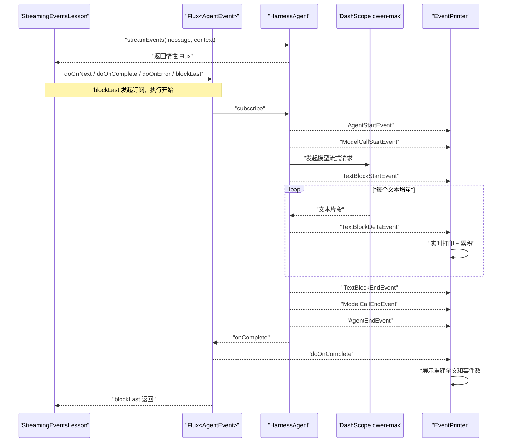

# 第 2 课：使用 streamEvents 观察 Agent 事件流

> 对应代码：[`StreamingEventsLesson.java`](../../src/main/java/com/example/agentscopedemo/lesson02/StreamingEventsLesson.java)

## 1. 学习目标

完成本课后，你应该能够：

- 解释 `Msg` 和 `AgentEvent` 分别表达什么。
- 说明 `call()` 与 `streamEvents()` 的共同点和区别。
- 理解 `Flux<AgentEvent>` 的含义。
- 识别 Agent、模型调用、文本块和工具调用的主要事件。
- 理解事件的 start → delta → end 生命周期。
- 使用 `replyId`、`blockId` 和 `toolCallId` 关联事件。
- 使用 `doOnNext` 观察事件、使用 `doOnComplete` 处理完成信号，并使用 `blockLast` 在控制台等待事件流结束。
- 从多个 `TextBlockDeltaEvent` 重建完整文本。
- 理解为什么响应式 Web 接口不应该调用 `blockLast()`。

## 2. 前置知识与环境

开始本课前，建议完成第一课并理解：

- `HarnessAgent.builder()` 的基本配置。
- `UserMessage`、`Msg` 和 `RuntimeContext`。
- `Mono<T>`、订阅和 `.block()` 的基本含义。
- `userId`、`sessionId` 与会话状态的关系。

运行环境与第一课相同：

- JDK 21。
- Maven 3.9+。
- IntelliJ IDEA。
- 一个有效的 DashScope API Key。

本课继续通过 IDEA Run Configuration 注入 `DASHSCOPE_API_KEY`。API Key 不能写入源码、配置文件或 Git。

## 3. 本课文件与依赖

入口类：

```text
com.example.agentscopedemo.lesson02.StreamingEventsLesson
```

本课不需要增加 Maven 依赖，继续使用第一课已经配置的：

```xml
<dependency>
    <groupId>io.agentscope</groupId>
    <artifactId>agentscope-harness</artifactId>
    <version>${agentscope.version}</version>
</dependency>

<dependency>
    <groupId>io.agentscope</groupId>
    <artifactId>agentscope-extensions-model-dashscope</artifactId>
    <version>${agentscope.version}</version>
</dependency>
```

Project Reactor 由 AgentScope 依赖传递进来，所以代码可以直接使用 AgentScope API 返回的 `Flux`，不需要再单独声明 Reactor 版本。

## 4. 核心心智模型

### 4.1 Msg 是结果，Event 是过程

第一课使用：

```java
Mono<Msg> result = agent.call(message, context);
```

`Msg` 表示一次完整的对话轮次。调用方只关心 Agent 最终说了什么时，`call()` 最直接。

第二课使用：

```java
Flux<AgentEvent> events = agent.streamEvents(message, context);
```

`AgentEvent` 表示执行过程中发生的一小步，例如：

- Agent 开始回复。
- 模型 API 调用开始。
- 一个文本块开始。
- 一段增量文本到达。
- 模型决定调用某个工具。
- 工具执行完成。
- Agent 完成回复。

可以先记住：

```text
Msg   = 一次完整回复的最终视图
Event = 构建这次回复时产生的增量过程
```

官方文档指出，一次 Agent 调用产生的事件序列最终会汇聚成一条完整的 assistant `Msg`。它们不是两套互不相关的数据，而是同一次执行的两种观察方式。

### 4.2 call 和 streamEvents 使用同一套 Agent 循环

两者不会让 Agent 采用不同的推理逻辑：

```text
用户消息
   ↓
同一套 reasoning → acting → reasoning 循环
   ├── call()         内部消费事件，只交付最终 Msg
   └── streamEvents() 向调用方逐个交付 AgentEvent
```

主要区别是结果交付方式：

| 对比项 | `call()` | `streamEvents()` |
| --- | --- | --- |
| 返回类型 | `Mono<Msg>` | `Flux<AgentEvent>` |
| 数据数量 | 最多一个最终消息 | 0 到 N 个过程事件 |
| 首次可见结果 | 通常等完整回复完成 | 第一个事件产生时即可看到 |
| 适合场景 | 后台任务、简单控制台、只关心最终结果 | 聊天 UI、SSE、进度展示、工具状态、HITL |
| 控制台终止操作 | `.block()` | `.blockLast()` |

不要对同一条用户消息先调用 `streamEvents()`，随后又调用 `call()` 来取得最终文本。那会启动两次独立 Agent 调用，可能产生两次模型费用、两轮状态写入和不同回复。正确做法是从事件流累积文本，或使用框架提供的完整结果事件/消息重建机制。

### 4.3 Flux 表示 0 到 N 个异步元素

第一课的 `Mono<Msg>` 最多产生一个值；本课的 `Flux<AgentEvent>` 可以持续产生多个事件：

```text
Flux<AgentEvent>
   ├── AgentStartEvent
   ├── ModelCallStartEvent
   ├── TextBlockStartEvent
   ├── TextBlockDeltaEvent
   ├── TextBlockDeltaEvent
   ├── TextBlockDeltaEvent
   ├── TextBlockEndEvent
   ├── ModelCallEndEvent
   └── AgentEndEvent
```

每一个 delta 都只是一个增量片段。它不保证恰好对应一个汉字、一个单词或一个模型 token。网络缓冲、模型提供商协议和 formatter 都可能影响片段大小，因此 UI 只能按顺序追加，不能假设固定粒度。

### 4.4 事件遵循 start → delta → end

类型化内容块通常具有生命周期：

```text
TextBlockStartEvent
    ↓
TextBlockDeltaEvent × N
    ↓
TextBlockEndEvent
```

工具调用也类似：

```text
ToolCallStartEvent
    ↓
ToolCallDeltaEvent × N
    ↓
ToolCallEndEvent
    ↓
ToolResultStartEvent
    ↓
ToolResultTextDeltaEvent × N
    ↓
ToolResultEndEvent
```

第三课注册自定义工具后，才能稳定观察第二条路径。本课没有工具，保留工具事件处理分支是为了提前看懂一个流式 UI 的基本骨架。

### 4.5 三种关联 ID

当多个文本块、工具调用甚至子 Agent 事件交错出现时，仅依赖事件顺序不够。AgentScope 提供关联键：

| ID | 作用 |
| --- | --- |
| `replyId` | 表示事件属于哪一条正在构建的回复 |
| `blockId` | 关联同一回复中的文本、思考或数据块 start/delta/end |
| `toolCallId` | 关联工具调用、参数片段和对应工具结果 |

概念关系：

```text
replyId = reply-123
├── blockId = text-1
│   ├── start
│   ├── delta × N
│   └── end
└── toolCallId = tool-456
    ├── tool call start/delta/end
    └── tool result start/delta/end
```

本课只有一个请求和一个主要文本块，所以使用一个 `StringBuilder` 就够了。真正的前端如果要支持多个块或子 Agent，应该按这些 ID 建立 Map，而不是把所有 delta 无条件拼到同一个字符串。

### 4.6 为什么流式输出更适合交互界面

假设模型完整回答需要 10 秒：

```text
call()
0 秒 ─────────────────────────── 10 秒
                                    └── 一次显示完整文本
```

使用事件流：

```text
streamEvents()
0 秒 ── 1 秒 ── 2 秒 ── 3 秒 ── ... ── 10 秒
       开始    文本片段 文本片段         完成
```

总耗时可能相近，但用户更早看到反馈，还能知道模型是否正在调用工具、等待确认或遇到错误。这改善的是“首个可见结果时间”和过程透明度，不保证模型本身生成得更快。

## 5. 代码逐段解析

### 5.1 事件类型 import

```java
import io.agentscope.core.event.AgentEndEvent;
import io.agentscope.core.event.AgentEvent;
import io.agentscope.core.event.AgentEventType;
import io.agentscope.core.event.AgentStartEvent;
import io.agentscope.core.event.TextBlockDeltaEvent;
import io.agentscope.core.event.ToolCallStartEvent;
import io.agentscope.core.event.ToolResultEndEvent;
```

- `AgentEvent` 是所有类型化事件的公共父类。
- `AgentEventType` 是事件类型枚举，适合日志、路由和统计。
- 具体事件类提供该类事件专属的 getter。

例如，仅知道 `AgentEvent` 时可以读取：

```java
event.getType();
event.getId();
event.getCreatedAt();
event.getSource();
event.getMetadata();
```

匹配为 `TextBlockDeltaEvent` 后还可以读取：

```java
delta.getReplyId();
delta.getBlockId();
delta.getDelta();
```

### 5.2 构建独立的第二课 Agent

```java
HarnessAgent agent = HarnessAgent.builder()
        .name("streaming-assistant")
        .sysPrompt("你是一位耐心的 AgentScope Java 学习助手，请用简洁的中文回答。")
        .model("dashscope:qwen-max")
        .workspace(Paths.get(".agentscope/workspace"))
        .compaction(CompactionConfig.builder()
                .triggerMessages(30)
                .keepMessages(10)
                .build())
        .build();
```

与第一课的主要区别是 Agent 名称改为 `streaming-assistant`，便于从状态目录和日志中区分课程实例。模型和 Workspace 配置保持一致，让注意力集中在事件 API。

### 5.3 为本课创建独立 session

```java
RuntimeContext context = RuntimeContext.builder()
        .userId("student")
        .sessionId("lesson-02")
        .build();
```

`sessionId=lesson-02` 避免把第二课消息追加到第一课会话上下文。

`userId` 仍然是 `student`，因此两课属于同一用户。会话上下文按 session 隔离，但用户长期记忆仍可能跨课程共享；这是第一课两层记忆模型的实际应用。

### 5.4 创建消息和事件打印器

```java
UserMessage message = new UserMessage(
        "请用三点解释 Agent、Message 和 Event 的区别，每点尽量简短。"
);
EventPrinter eventPrinter = new EventPrinter();
```

`EventPrinter` 同时维护：

- `eventCount`：观察一共收到多少事件。
- `accumulatedText`：按顺序累积所有文本 delta。

把状态集中在一个小对象中，比在 lambda 外使用数组或多个 `AtomicReference` 更容易阅读。

### 5.5 streamEvents 返回 Flux

```java
agent.streamEvents(message, context)
```

当前项目使用的 AgentScope 2.0.1 中，`HarnessAgent` 提供：

```java
Flux<AgentEvent> streamEvents(Msg message, RuntimeContext context)
```

`RuntimeContext` 在整个流生命周期内绑定到当前调用，下游的状态加载、Middleware 和工具都能识别正确的用户与 session；事件流结束后自动解绑。

### 5.6 doOnNext 只观察，不转换

```java
.doOnNext(eventPrinter::print)
```

它等价于：

```java
.doOnNext(event -> eventPrinter.print(event))
```

`doOnNext` 是旁路观察 operator：

- 每次上游产生事件时执行副作用。
- 不修改事件。
- 不把 `AgentEvent` 转换成其他类型。
- 不会单独触发订阅。

如果要转换数据，应该使用 `map`：

```java
Flux<String> types = events.map(event -> event.getType().name());
```

如果只保留部分事件，使用 `filter`：

```java
Flux<AgentEvent> textEvents = events.filter(
        event -> event instanceof TextBlockDeltaEvent
);
```

### 5.7 doOnError 记录错误，但不吞掉错误

```java
.doOnError(error -> System.err.println("\n[错误] " + error.getMessage()))
```

`doOnError` 适合日志和监控，它不会把失败变成成功。记录后，错误信号仍继续向下游传播，所以最后的 `blockLast()` 仍会抛出异常。

如果业务确实需要降级，使用 `onErrorResume`：

```java
.onErrorResume(error -> Flux.empty())
```

但入门阶段不要为了让控制台“看起来正常”而吞掉异常，否则 API Key、网络和模型错误会更难排查。

### 5.8 blockLast 是终止订阅操作

```java
.blockLast();
```

这行在控制台程序中承担两个职责：

1. 订阅 `Flux<AgentEvent>`，真正启动 Agent 调用。
2. 阻塞当前 `main` 线程，直到事件流正常完成或失败。

为什么是 `blockLast()` 而不是 `block()`：

- `Mono` 最多一个值，使用 `block()`。
- `Flux` 有多个值，`blockLast()` 会持续消费，等待最后一个事件和完成信号。

本课不使用 `blockLast()` 的返回值，因为所有事件已经通过 `doOnNext` 观察。

如果把 `.blockLast()` 删除，代码只组装了一个惰性 Flux，没有订阅；除了调用前的“客户端已发起请求”文字，通常不会发生模型调用，也不会收到事件。

在 Spring WebFlux Controller 中不能照搬 `.blockLast()`。正确方式是把 `Flux` 返回给 Spring，由框架订阅并通过 SSE 等协议持续写给客户端。

### 5.9 使用 Java 模式匹配分派事件

```java
if (event instanceof AgentStartEvent start) {
    // start 已自动转换为 AgentStartEvent
} else if (event instanceof TextBlockDeltaEvent delta) {
    // delta 已自动转换为 TextBlockDeltaEvent
}
```

这是 Java 的 `instanceof` 模式匹配。它比下面写法更紧凑：

```java
if (event instanceof TextBlockDeltaEvent) {
    TextBlockDeltaEvent delta = (TextBlockDeltaEvent) event;
}
```

官方示例也常用 `instanceof` 分派。另一种方式是先判断 `event.getType()`，再做强制转换。具体类模式匹配更不容易把枚举类型和 Java 类型转换错配。

### 5.10 实时输出并累积文本

```java
} else if (event instanceof TextBlockDeltaEvent delta) {
    accumulatedText.append(delta.getDelta());
    System.out.print(delta.getDelta());
    System.out.flush();
}
```

三行分别负责：

1. 将片段追加到完整文本。
2. 不换行地打印当前片段，形成连续输出。
3. 主动刷新标准输出缓冲区，让片段尽快出现在 IDEA 控制台。

`StringBuilder` 在本例中可用，因为同一个 Reactive Streams Subscriber 接收的 `onNext` 信号遵循串行约束。本课没有调用 `parallel()` 或手动把事件分发到多个线程。如果未来主动并行处理同一个构建器，就必须重新考虑线程安全和事件顺序。

### 5.11 为什么不打印其他 DELTA

```java
} else if (!event.getType().name().endsWith("_DELTA")) {
    printEvent(event.getType(), null);
}
```

本课对 `TextBlockDeltaEvent` 有专门处理。其他高频 delta 只计数，不使用通用日志逐条打印，原因包括：

- 避免工具参数、二进制数据片段把控制台刷满。
- 避免把模型内部 thinking 内容直接展示成最终答复。
- 保持“模型文本”和“生命周期日志”容易区分。

生产 UI 应根据产品需求明确决定每种事件怎样展示，不能把所有事件直接 `toString()` 后发给最终用户。

### 5.12 区分 AgentEndEvent 与 Flux 的完成信号

```java
} else if (event instanceof AgentEndEvent end) {
    printEvent(end.getType(), "replyId=" + end.getReplyId());
}
```

`AgentEndEvent` 是 AgentScope 发出的一个**业务事件**，表示本轮 Agent 执行已经结束。它仍然是 `Flux` 中的一项数据。

最终汇总放在 Reactor 的完成回调中：

```java
.doOnComplete(eventPrinter::printSummary)
```

```java
private void printSummary() {
    System.out.println("\n[重建后的完整文本]\n" + accumulatedText);
    System.out.println("\n[统计] 共收到 " + eventCount + " 个事件。");
}
```

`onComplete` 不是普通事件，而是 Reactive Streams 的终止信号，表示发布者不会再发送任何数据。等到这个信号再统计，能够确保已经数完这条流中的所有事件。

如果流以错误结束，会发出 `onError` 而不是 `onComplete`，因此 `printSummary()` 不会执行；失败仍会继续传到 `blockLast()`。

控制台会看到文本两次：

- 第一次是 delta 到达时逐片追加的实时输出。
- 第二次是事件流结束后由 `StringBuilder` 重建的完整文本。

这是有意设计的教学效果，不是 Agent 调用了模型两次。

## 6. 完整执行流程



如果模型发起工具调用，中间会额外出现 acting 阶段，然后 Agent 可能再次进入模型 reasoning，因此一次回复可以包含多个 ModelCall 生命周期。

## 7. 在 IDEA 中运行

### 7.1 创建第二课运行配置

最简单的方法是复制第一课配置：

1. 打开 `运行 → 编辑配置`。
2. 选中 `FirstAgentLesson`。
3. 点击复制配置。
4. 名称改为 `StreamingEventsLesson`。
5. 主类改为：

```text
com.example.agentscopedemo.lesson02.StreamingEventsLesson
```

6. 保留环境变量名 `DASHSCOPE_API_KEY`，确保值是当前有效且未泄露的新 Key。
7. 工作目录保持项目根目录。

不要勾选“存储为项目文件”，避免把包含凭据的运行配置纳入共享项目文件。

### 7.2 运行并观察

点击 `StreamingEventsLesson.main()` 旁边的绿色运行按钮。重点观察：

- `AGENT_START` 是否先出现。
- `TEXT_BLOCK_DELTA` 对应的文本是否逐渐显示。
- 文本片段之间是否没有自动换行。
- `AGENT_END` 是否在完整回复之后出现。
- 重建后的完整文本是否与前面增量拼接一致。

## 8. 预期结果

具体事件数量、片段大小和自然语言内容都可能变化。示意输出：

```text
[客户端] 已发起请求，等待 Agent 事件……

[事件 1] AGENT_START | sessionId=lesson-02, replyId=...

[事件 2] MODEL_CALL_START

[事件 3] TEXT_BLOCK_START
1. Agent 是执行推理与行动的主体。
2. Message 是完整的一轮通信内容。
3. Event 是执行过程中的增量更新。

[事件 20] TEXT_BLOCK_END

[事件 21] MODEL_CALL_END

[事件 22] AGENT_END | replyId=...

[重建后的完整文本]
1. Agent 是执行推理与行动的主体。
2. Message 是完整的一轮通信内容。
3. Event 是执行过程中的增量更新。

[统计] 共收到 22 个事件。
```

事件编号可能跳跃。例如日志从 `[事件 3]` 跳到 `[事件 20]`，是因为中间多个高频 delta 被统计了，但它们直接作为正文打印，没有逐条显示事件标题。

本课没有注册工具，因此通常不会出现：

```text
TOOL_CALL_START
TOOL_RESULT_END
```

这是预期行为，不是代码分支失效。

## 9. 动手实验

每个实验都先预测结果，再修改运行。

### 实验一：删除 blockLast

临时删除：

```java
.blockLast();
```

预测：程序只打印“客户端已发起请求”，不会真正收到 Agent 事件，因为没有终止订阅操作。

结论：`doOnNext` 定义观察行为，但不负责启动惰性 Flux。

### 实验二：使用 subscribe

把 `blockLast()` 改成：

```java
.subscribe();
```

预测：订阅会启动，但 `main` 不再等待。控制台程序的生命周期可能在异步任务完成前结束，或者输出行为取决于框架内部线程是否仍存活。

结论：`subscribe()` 适合由更长生命周期组件管理订阅；简单控制台需要明确等待完成。

### 实验三：只保留文本 delta

在 `doOnNext` 前加入：

```java
.filter(event -> event instanceof TextBlockDeltaEvent)
```

预测：`EventPrinter` 只能收到文本 delta，不再收到 `AgentStartEvent` 和 `AgentEndEvent`；但过滤后的 Flux 仍会发出 `onComplete`，因此重建结果和统计仍会打印。此时统计值只包含通过过滤器的文本 delta 数量。

结论：`filter` 会真实改变下游能看到的事件，不只是控制日志显示。

### 实验四：统计每种事件数量

在 `EventPrinter` 中增加：

```java
Map<AgentEventType, Integer> counts = new EnumMap<>(AgentEventType.class);
```

每次事件到达时执行：

```java
counts.merge(event.getType(), 1, Integer::sum);
```

预测：`TEXT_BLOCK_DELTA` 数量通常最多；生命周期 start/end 通常各一次，但复杂工具循环可能有多次模型调用。

### 实验五：对比首字时间与总耗时

在发起调用前记录：

```java
long startedAt = System.nanoTime();
```

第一次 `TextBlockDeltaEvent` 到达时记录首字耗时，`AgentEndEvent` 到达时记录 Agent 执行耗时；如果要测整条响应式管线的完成耗时，则在 `doOnComplete` 中记录。

预测：首字耗时显著小于总耗时；这正是流式 UI 改善体验的原因。

### 实验六：验证同一 session 的连续对话

保持相同 `RuntimeContext`，事件流结束后再调用一次：

```java
agent.streamEvents(new UserMessage("请复述我刚才的问题。"), context)
        .doOnNext(new EventPrinter()::print)
        .blockLast();
```

预测：第二次调用能读取第一次会话上下文；它会产生一套新的 `replyId` 和新的事件生命周期。

### 实验七：比较 call 与 streamEvents

分别使用 `call` 和 `streamEvents` 处理相似问题，但不要在同一个 session 中对完全相同消息连续执行后误认为是同一次调用。

观察：

- `call` 代码简单，但只在完成时得到 `Msg`。
- `streamEvents` 代码更复杂，但可以展示过程和首字响应。

## 10. 常见问题

### 10.1 只显示“客户端已发起请求”

检查：

1. 是否保留 `.blockLast()` 或其他订阅操作。
2. API Key 是否有效。
3. IDEA 当前运行的是否为 `StreamingEventsLesson`。
4. 网络是否能访问 DashScope。

### 10.2 文本不是一个字一个字出现

正常。`delta` 是模型提供商和网络层提供的增量片段，不保证一个片段对应一个字符或 token。流式的定义是“完成前逐步交付”，不是固定粒度。

### 10.3 文本看起来一次性出现

可能原因：

- 模型或提供商返回的片段较大。
- IDEA 控制台缓冲。
- 网络代理进行了缓冲。
- 回答太短，片段间隔肉眼不明显。

本课调用了 `System.out.flush()`，已经尽量减少 Java 标准输出缓冲的影响。可以要求模型输出更长内容进行观察，但会增加 token 消耗。

### 10.4 为什么完整文本打印了两次

第一次是实时 delta；第二次是教学代码从 delta 重建的完整文本。只有一次 Agent 调用和一次模型回复。

### 10.5 为什么工具事件分支没有执行

本课没有向 Agent 注册自定义工具。第三课会添加 `@Tool`，届时可以观察 ToolCall 和 ToolResult 生命周期。

### 10.6 doOnError 打印后为什么还有异常堆栈

`doOnError` 只观察错误，不会恢复。错误继续传到 `blockLast()` 并被抛出。这样能保留完整失败信息。

### 10.7 事件顺序为什么比讲义复杂

Harness 可能执行记忆、上下文处理或多轮 reasoning。注册工具后，一个回复还可能包含多次模型调用。不要把示意序列当作所有场景的固定完整列表；应依据事件类型和关联 ID 构建消费者。

### 10.8 能否在 Web Controller 中使用 blockLast

不应在 WebFlux event-loop 中阻塞。Controller 应返回 `Flux`，通常以 `text/event-stream` SSE 形式交给 Spring。第 4 课会系统比较 Spring MVC 与 WebFlux。

### 10.9 是否应该显示 ThinkingBlockDeltaEvent

不建议默认把内部 thinking 片段当作最终答案展示。生产 UI 应只展示经过产品设计允许的进度和内容，并注意模型提供商政策、隐私和安全要求。

## 11. 课后自测

### 问题

1. `Msg` 和 `AgentEvent` 的核心区别是什么？
2. `call()` 和 `streamEvents()` 是否使用不同的推理循环？
3. `Flux<AgentEvent>` 中的 `0..N` 表示什么？
4. 为什么不能假设一个 `TextBlockDeltaEvent` 对应一个 token？
5. `doOnNext` 会自动订阅 Flux 吗？
6. `blockLast()` 在本课中承担哪两个职责？
7. 为什么不应对同一用户消息同时调用 `call()` 和 `streamEvents()`？
8. `replyId`、`blockId`、`toolCallId` 分别关联什么？
9. 为什么本课使用 `System.out.print` 而不是 `println` 输出 delta？
10. 为什么本课没有出现 ToolCall 事件？
11. `doOnError` 是否会吞掉错误？
12. WebFlux Controller 应该怎样处理 `Flux<AgentEvent>`？

### 参考答案

1. `Msg` 是完整对话轮次；`AgentEvent` 是构建回复过程中的增量更新。
2. 不是。它们驱动同一套 Agent 循环，只是结果交付方式不同。
3. 一次订阅可能没有事件，也可能按顺序产生多个事件，直到完成或失败。
4. delta 粒度受模型提供商、协议、formatter 和网络缓冲影响。
5. 不会。它只是声明事件到达时执行的副作用。
6. 发起订阅，并阻塞 `main` 线程直到整个 Flux 结束。
7. 这会启动两次独立调用，产生重复费用、状态和可能不同的回答。
8. 分别关联一条回复、一个内容块生命周期、一组工具调用与结果。
9. delta 需要连续拼接；`println` 会给每个片段强制增加换行。
10. Agent 没有注册本课可调用的自定义工具。
11. 不会；错误仍会传播到 `blockLast()`。
12. 返回 Flux 给 Spring，由框架订阅并以 SSE 等方式写给客户端，不在 event-loop 调用 `blockLast()`。

## 12. 本课小结

第二课把第一课的一次完整 `Msg` 拆开成了可观察的执行过程：

```text
UserMessage + RuntimeContext
        ↓
HarnessAgent.streamEvents
        ↓
Flux<AgentEvent>
        ├── 生命周期事件
        ├── 模型调用事件
        ├── 文本 start/delta/end
        ├── 工具调用与结果事件
        └── Agent 完成事件
```

本课最重要的代码主线是：

```java
agent.streamEvents(message, context)
        .doOnNext(eventPrinter::print)
        .doOnComplete(eventPrinter::printSummary)
        .doOnError(...)
        .blockLast();
```

请牢牢记住：`doOnNext` 观察每个数据事件，`doOnComplete` 观察正常完成信号；它们都不会主动订阅。`blockLast` 才在控制台中触发订阅并等待整条事件流完成。

## 13. 官方资料与下一课

- [AgentScope：消息与事件](https://java.agentscope.io/v2/zh/docs/building-blocks/message-and-event.html)
- [AgentScope：Agent 的 call 与 streamEvents](https://java.agentscope.io/v2/zh/docs/building-blocks/agent.html)
- [AgentScope Java 2.0 中文快速开始](https://java.agentscope.io/v2/zh/docs/quickstart.html)
- [Project Reactor：Flux，异步的 0..N 序列](https://projectreactor.io/docs/core/release/reference/coreFeatures/flux.html)
- [Project Reactor：订阅与背压](https://projectreactor.io/docs/core/release/reference/reactiveProgramming.html)

下一课将注册第一个自定义 `@Tool`。我们会观察模型如何生成 ToolCall，AgentScope 如何执行 Java 方法并产生 ToolResult，以及为什么工具描述和参数 Schema 会直接影响模型是否正确调用工具。
