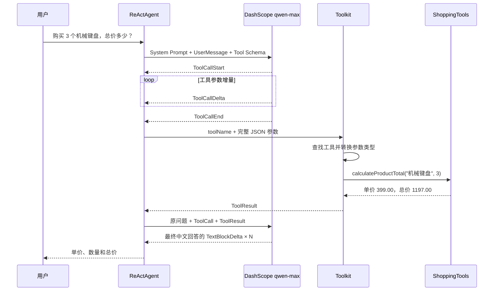

# 第 3 课：使用 ReActAgent 和 @Tool 编写 Java 工具

配套文件：

- 入口代码：[`ToolCallingLesson.java`](../../src/main/java/com/example/agentscopedemo/lesson03/ToolCallingLesson.java)
- 工具代码：[`ShoppingTools.java`](../../src/main/java/com/example/agentscopedemo/lesson03/ShoppingTools.java)
- 单元测试：[`ShoppingToolsTest.java`](../../src/test/java/com/example/agentscopedemo/lesson03/ShoppingToolsTest.java)

## 1. 学习目标

完成本课后，你应该能够：

- 解释大模型为什么需要 Tool，而不仅仅依靠自身生成文本。
- 说明 `@Tool`、`@ToolParam`、`Toolkit` 和 `ReActAgent` 的分工。
- 理解 Java 方法如何通过反射转换成模型可见的 JSON Schema。
- 区分“模型生成工具调用”“Java 方法真正执行”“工具结果返回模型”三个阶段。
- 看懂 `ToolCallStart/Delta/End` 与 `ToolResultStart/Delta/End` 事件。
- 解释一次工具问答为什么通常至少包含两次模型调用。
- 使用单元测试直接验证工具业务逻辑，而不调用大模型。
- 理解 Tool 描述、参数描述、参数校验和返回值对可靠性的影响。

## 2. 前置知识与环境

开始本课前，建议已经理解：

- 第一课中的 `Msg`、`RuntimeContext` 和 Agent 基本调用。
- 第二课中的 `Flux<AgentEvent>`、`doOnNext`、`doOnComplete` 和 `blockLast()`。
- AgentScope 事件的 start → delta → end 设计。
- Java 注解、方法参数和普通类的基本语法。

运行环境继续使用：

- JDK 21。
- Maven Wrapper。
- IntelliJ IDEA。
- DashScope API Key。

本课没有新增密钥。仍然只需要环境变量：

```text
DASHSCOPE_API_KEY
```

`ShoppingToolsTest` 不访问模型和网络，因此运行单元测试时不需要 API Key。

## 3. 本课文件与依赖

### 3.1 三个文件分别负责什么

```text
lesson03
├── ShoppingTools.java
│   └── 普通 Java 业务逻辑 + @Tool/@ToolParam
├── ToolCallingLesson.java
│   └── 创建 Toolkit、Model、ReActAgent，并观察事件
└── ShoppingToolsTest.java
    └── 不经过大模型，直接测试工具逻辑
```

把工具类和入口类拆开，是为了建立一个重要习惯：

```text
Agent 编排代码 ≠ 业务工具代码
```

工具最终可能调用数据库、订单服务或公司内部 API。它应该像普通业务代码一样能够独立测试，而不是必须启动大模型后才能验证。

### 3.2 Maven 依赖

本课不需要修改 `pom.xml`，继续使用：

```xml
<dependency>
    <groupId>io.agentscope</groupId>
    <artifactId>agentscope-harness</artifactId>
    <version>${agentscope.version}</version>
</dependency>

<dependency>
    <groupId>io.agentscope</groupId>
    <artifactId>agentscope-extensions-model-dashscope</artifactId>
    <version>${agentscope.version}</version>
</dependency>
```

虽然本课入口使用的是核心 `ReActAgent`，但 `agentscope-harness` 会传递引入 AgentScope Core；DashScope 扩展则提供 `DashScopeChatModel` 和 formatter。

## 4. 核心心智模型

### 4.1 大模型不会直接执行 Java 方法

大模型本质上生成内容。即使它输出了下面的文字：

```json
{
  "name": "calculate_product_total",
  "arguments": {
    "productName": "机械键盘",
    "quantity": 3
  }
}
```

这也只是一次“调用工具的结构化请求”，并不等于 Java 方法已经执行。

真正的执行流程是：

```text
模型决定调用哪个工具并生成参数
              ↓
AgentScope 解析 ToolCall
              ↓
Toolkit 根据工具名查找 Java 方法
              ↓
反射调用 ShoppingTools.calculateProductTotal(...)
              ↓
把 Java 返回值转换成 ToolResult
              ↓
再次交给模型组织最终回答
```

所以工具调用涉及两种不同角色：

- 模型负责“选择什么能力、提供什么参数”。
- Java 程序负责“校验参数、执行真实业务、返回真实结果”。

### 4.2 Tool、Toolkit、ReActAgent 三层分工

可以把三者理解成：

| 组件 | 类比 | 本课职责 |
| --- | --- | --- |
| `@Tool` 方法 | 一项具体能力 | 根据商品和数量计算总价 |
| `Toolkit` | 工具箱和调度表 | 注册工具、提供 Schema、按名称分发调用 |
| `ReActAgent` | 会思考并使用工具的人 | 判断是否调用、读取结果、继续回答 |

对应代码：

```java
Toolkit toolkit = new Toolkit();
toolkit.registerTool(new ShoppingTools());

ReActAgent agent = ReActAgent.builder()
        .toolkit(toolkit)
        .build();
```

只写 `@Tool` 不注册，Agent 不知道它存在；只注册 Toolkit 但没有交给 Agent，模型也看不到其中的工具。

### 4.3 ReAct 是 Reasoning + Acting

ReAct 可以先简化理解为：

```text
Reasoning：根据问题判断下一步
Acting：调用工具执行动作
Observation：读取工具结果
Reasoning：根据结果继续判断或回答
```

本课通常会产生这样的过程：

```text
第一次模型调用
  └── 决定调用 calculate_product_total
          ↓
Java 工具执行
          ↓
第二次模型调用
  └── 根据 ToolResult 生成最终中文回答
```

因此控制台中的 `模型调用=2` 通常是正常现象，并不代表同一个问题被无意义地重复询问了两次。两次模型调用承担的任务不同。

如果第二次模型调用又发现需要其他工具，ReAct 循环还会继续。`.maxIters(5)` 为循环设置上限，防止模型持续调用工具而无法结束。

### 4.4 @Tool 是 Java 注解，但语义由 AgentScope 定义

```java
@Tool(
        name = "calculate_product_total",
        description = "查询演示商品的固定单价并计算购买总价。",
        readOnly = true,
        concurrencySafe = true
)
```

这里要区分两件事：

- `@Tool` 在 Java 语法上是一个注解。
- “把该方法转换成 Agent 工具”是 AgentScope 对这个注解的解释。

Java 自己不会因为看到 `@Tool` 就调用该方法。`Toolkit.registerTool(...)` 会通过反射扫描对象的方法，发现 AgentScope 的 `@Tool` 注解，然后完成注册。

### 4.5 模型真正看到的是 JSON Schema

模型看不到 Java 源码，也不知道 `ShoppingTools` 类里的 `Map`。AgentScope 会根据注解和 Java 类型生成类似下面的 Schema：

```json
{
  "name": "calculate_product_total",
  "description": "查询演示商品的固定单价并计算购买总价……",
  "parameters": {
    "type": "object",
    "properties": {
      "productName": {
        "type": "string",
        "description": "商品名称，只支持：机械键盘、无线鼠标、显示器"
      },
      "quantity": {
        "type": "integer",
        "description": "购买数量，必须是 1 到 100 之间的整数"
      }
    },
    "required": ["productName", "quantity"]
  }
}
```

实际打印格式可能是 Java `Map` 的形式，但表达的结构相同。

模型主要依据以下信息决定如何调用：

1. Tool 名称。
2. Tool 描述。
3. 参数名称。
4. 参数类型。
5. 参数描述和是否必填。

所以 description 不是写给普通 Java 调用者看的装饰文字，它会直接影响模型的工具选择和参数质量。

### 4.6 ToolCall、Java 执行与 ToolResult 不能混为一谈

本课控制台会同时展示三类证据：

```text
[工具参数流] ...
```

表示模型正在生成 ToolCall 参数。

```text
[Java 工具真正执行] productName=机械键盘, quantity=3
```

表示 AgentScope 已经完成参数解析，Java 方法此刻真正被调用。

```text
TOOL_RESULT_START / TOOL_RESULT_END
```

表示 Java 返回值正在作为 ToolResult 进入 Agent 事件流。

它们发生在不同时间，解决不同问题。

### 4.7 readOnly 与 concurrencySafe 是工具元数据

```java
readOnly = true,
concurrencySafe = true
```

`readOnly=true` 表示该工具不会修改外部状态。本课只读取固定价格并计算结果，不创建订单、不扣库存，所以它是只读工具。

`concurrencySafe=true` 表示多个调用并发执行时不会互相破坏状态。本课只读取不可变价格表，并且所有计算变量都在方法内部，所以可以声明并发安全。

这两个属性必须如实填写。比如“删除订单”显然不能声明为只读；使用非线程安全共享变量的工具也不能随便声明并发安全。

## 5. 代码逐段解析

### 5.1 固定演示价格表

```java
private static final Map<String, BigDecimal> UNIT_PRICES = Map.of(
        "机械键盘", new BigDecimal("399.00"),
        "无线鼠标", new BigDecimal("129.00"),
        "显示器", new BigDecimal("1599.00")
);
```

这里故意使用本地固定数据，而不是调用真实商城接口，原因是：

- 每次运行结果可重复。
- 不需要额外账号和网络服务。
- 能把注意力集中在 Tool 调用链。
- 单元测试可以得到确定结果。

金额使用 `BigDecimal`，避免使用 `double` 进行货币运算时可能出现的二进制浮点误差。

### 5.2 声明 Tool

```java
@Tool(
        name = "calculate_product_total",
        description = "查询演示商品的固定单价并计算购买总价……",
        readOnly = true,
        concurrencySafe = true
)
public String calculateProductTotal(...) {
    // 普通 Java 业务逻辑
}
```

Tool 的 `name` 是模型生成 ToolCall 时使用的名称，也是 Toolkit 分发时使用的键。名称应该：

- 稳定，不随意修改。
- 能表达动作。
- 尽量使用简单英文、数字和下划线。
- 在同一个 Toolkit 中保持唯一。

Java 方法名可以和 Tool 名不同。本课 Java 方法是 `calculateProductTotal`，对模型暴露的名称是 `calculate_product_total`。

### 5.3 声明 Tool 参数

```java
@ToolParam(
        name = "productName",
        description = "商品名称，只支持：机械键盘、无线鼠标、显示器"
)
String productName
```

以及：

```java
@ToolParam(
        name = "quantity",
        description = "购买数量，必须是 1 到 100 之间的整数"
)
Integer quantity
```

`@ToolParam` 告诉 AgentScope：这个值需要由模型在工具参数 JSON 中提供。

Java 类型会参与 Schema 推导：

```text
String  → string
Integer → integer
```

本课显式写出了 `name`，因此不依赖编译器是否保留 Java 参数名。`@ToolParam.required` 默认是 `true`，所以这两个参数会进入 JSON Schema 的 `required` 列表。

### 5.4 为什么仍然需要 Java 参数校验

```java
if (quantity == null || quantity < 1 || quantity > 100) {
    return "工具执行失败：购买数量必须是 1 到 100 之间的整数。";
}
```

参数描述告诉模型应该怎样传值，但它不是安全边界。模型可能理解错误，调用方也可能绕过模型直接调用 Tool。

正确分工是：

```text
Schema/description：提高模型生成正确参数的概率
Java 参数校验：真正保证业务规则
```

永远不能因为 prompt 中写了“数量必须大于 0”，就删除服务端校验。

### 5.5 String 返回值去了哪里

```java
return "查询成功：商品=" + productName + ...;
```

注解式 Tool 可以像普通方法一样返回 `String`。AgentScope 的默认结果转换器会把它转换成 `ToolResultBlock`，然后放回 Agent 的执行上下文。

这个字符串不是直接显示给最终用户的最终回答。正常流程是：

```text
Java String
  ↓ 默认结果转换器
ToolResultBlock
  ↓ 作为观察结果交给模型
模型生成最终 Msg
```

模型有机会把工具的结构化事实组织成更自然的中文回答。

### 5.6 注册工具

```java
Toolkit toolkit = new Toolkit();
toolkit.registerTool(new ShoppingTools());
```

`registerTool(Object)` 会扫描传入对象中的 `@Tool` 方法。一个对象可以包含多个 `@Tool` 方法，它们会分别注册。

本课随后打印：

```java
for (ToolSchema schema : toolkit.getToolSchemas()) {
    System.out.println(schema.getName());
    System.out.println(schema.getDescription());
    System.out.println(schema.getParameters());
}
```

这样可以亲眼看到模型获得的并不是 Java 代码，而是 Tool Schema。

### 5.7 显式构建 DashScopeChatModel

```java
DashScopeChatModel model = DashScopeChatModel.builder()
        .apiKey(apiKey)
        .modelName("qwen-max")
        .stream(true)
        .enableThinking(false)
        .formatter(new DashScopeChatFormatter())
        .build();
```

前两课使用了简写：

```java
.model("dashscope:qwen-max")
```

本课显式创建 Model，是为了看清各层职责：

- `DashScopeChatModel` 负责调用 DashScope 模型 API。
- `DashScopeChatFormatter` 负责在 AgentScope 消息与 DashScope 请求/响应格式之间转换。
- `stream(true)` 让模型以流式方式返回内容。
- `enableThinking(false)` 让本课集中观察 Tool 事件，避免额外 thinking 事件干扰。
- `ReActAgent` 负责模型与工具之间的循环编排。

### 5.8 构建 ReActAgent

```java
ReActAgent agent = ReActAgent.builder()
        .name("shopping-assistant")
        .sysPrompt("...")
        .model(model)
        .toolkit(toolkit)
        .maxIters(5)
        .build();
```

与前两课的 `HarnessAgent` 相比：

| 对比项 | `ReActAgent` | `HarnessAgent` |
| --- | --- | --- |
| 定位 | AgentScope 核心 ReAct Agent | 面向编码/工作区任务的高级封装 |
| 工具 | 显式创建并传入 Toolkit | 自带多种 workspace 工具，也可扩展 |
| 适合本课原因 | 能清楚看到最小 Tool 装配过程 | 默认能力更多，初学时不容易区分来源 |

本课使用 `ReActAgent`，是为了让工具链尽量透明，并不是说 `HarnessAgent` 不能使用工具。

### 5.9 System Prompt 为什么要求必须调用工具

```text
当用户询问商品购买总价时，必须调用 calculate_product_total，
不能自己猜测价格或心算。
```

Tool Schema 只是提供选择，默认情况下是否调用仍由模型判断。为了让第一次实验稳定观察 ToolCall，本课通过 system prompt 和用户消息共同明确要求调用。

真实项目不能只依赖 prompt 保证敏感流程。涉及支付、删除、发消息等操作时，还必须加入服务端校验、身份验证、授权、幂等和 AgentScope 权限机制。

### 5.10 观察 ToolCall 参数流

```java
} else if (event instanceof ToolCallDeltaEvent delta) {
    argumentsByToolCall
            .computeIfAbsent(delta.getToolCallId(), ignored -> new StringBuilder())
            .append(delta.getDelta());
    System.out.print(delta.getDelta());
}
```

工具参数也可能分片到达，例如：

```text
{"product
Name":"机械
键盘","quantity":3}
```

每个 delta 不保证是完整 JSON，也不保证在字符串边界处分割。因此不能对单个 delta 立即做完整 JSON 解析；需要按照相同的 `toolCallId` 追加，等到 `ToolCallEndEvent` 后再把它看作完整参数。

`toolCallId` 还会出现在对应的 ToolResult 事件中，用来回答：这个结果属于哪一次调用？

### 5.11 观察 ToolResult

```java
} else if (event instanceof ToolResultEndEvent toolResult) {
    printEvent(
            toolResult.getType(),
            "toolCallId=" + toolResult.getToolCallId()
                    + ", state=" + toolResult.getState()
    );
}
```

ToolResult 也有自己的生命周期：

```text
ToolResultStartEvent
    ↓
ToolResultTextDeltaEvent × 0..N
    ↓
ToolResultEndEvent
```

`state` 用来表示工具结果状态。不要仅凭“收到了 EndEvent”就判断业务一定成功，还应检查状态和结果内容。

### 5.12 统计模型调用和工具调用

```java
private int modelCallCount;
private int toolCallCount;
```

收到 `ModelCallStartEvent` 时增加模型调用数，收到 `ToolCallStartEvent` 时增加工具调用数。

对本课问题，最典型的结果是：

```text
模型调用=2，工具调用=1
```

但模型输出具有一定非确定性。重要的不是死记数字，而是理解每次调用承担的阶段。

### 5.13 try-with-resources

```java
try (ReActAgent agent = ReActAgent.builder()
        // ...
        .build()) {
    // 调用 Agent
}
```

`ReActAgent` 实现了 `AutoCloseable`。try-with-resources 会在代码块结束或发生异常时调用 `close()`，释放 Agent 持有的运行资源。

### 5.14 工具单元测试

```java
@Test
void shouldCalculateKnownProductTotal() {
    String result = tools.calculateProductTotal("机械键盘", 3);

    assertEquals(
            "查询成功：商品=机械键盘，单价=399.00元，数量=3，总价=1197.00元。",
            result
    );
}
```

测试直接调用普通 Java 方法，没有创建 Model、Toolkit 或 Agent：

```text
JUnit → ShoppingTools → 断言结果
```

这说明工具业务逻辑和 LLM 编排是可以分层测试的。生产项目通常应该：

- 大量使用快速、确定的普通单元测试验证工具业务。
- 少量使用需要 API Key 的集成测试验证模型是否正确选择工具。
- 不把所有验证都交给昂贵且具有非确定性的模型调用。

## 6. 完整执行流程



用事件序列表示，大致是：

```text
AgentStartEvent
├── ModelCallStartEvent                 第一次模型调用
├── ToolCallStartEvent
├── ToolCallDeltaEvent × N              模型生成参数
├── ToolCallEndEvent
├── ModelCallEndEvent
├── ToolResultStartEvent
├── ToolResultTextDeltaEvent × N         Java 返回值
├── ToolResultEndEvent
├── ModelCallStartEvent                 第二次模型调用
├── TextBlockStartEvent
├── TextBlockDeltaEvent × N              最终回答
├── TextBlockEndEvent
├── ModelCallEndEvent
└── AgentEndEvent
onComplete                              Reactor 完成信号
```

具体事件可能因模型提供商和框架内部处理稍有不同，不应把这张示意图当作所有情况下固定不变的日志清单。

## 7. 在 IDEA 中运行

### 7.1 入口类

运行：

```text
com.example.agentscopedemo.lesson03.ToolCallingLesson
```

可以直接打开 `ToolCallingLesson.java`，点击 `main` 左侧的绿色三角。

### 7.2 关于 DASHSCOPE_API_KEY

你已经知道需要配置 `DASHSCOPE_API_KEY`，本课没有新的环境变量。

如果 API Key 配置在 Windows 系统环境变量中，并且 IDEA 已经重启，新运行配置通常可以直接继承。

如果 API Key 只配置在第一课或第二课的 IDEA Run Configuration 中，那么新自动生成的配置不一定继承。此时有两种等价做法：

1. 复制原运行配置，只把主类改成 `ToolCallingLesson`；API Key 会跟着复制。
2. 直接新建本课配置，再手动加入同名环境变量。

复制运行配置只是为了少填一次，不是 AgentScope 的特殊要求。

不要把 API Key 写入：

- `ToolCallingLesson.java`
- `application.properties`
- Markdown 讲义
- Git 提交

### 7.3 单独运行工具测试

打开 `ShoppingToolsTest.java`，点击类名旁边的绿色三角。这个测试不需要 API Key，也不会产生模型费用。

也可以在项目终端运行：

```powershell
.\mvnw.cmd test
```

## 8. 预期结果

你首先会看到注册后的 Schema，内容类似：

```text
[Toolkit] 已注册工具及其 JSON Schema：
- name: calculate_product_total
  description: 查询演示商品的固定单价并计算购买总价……
  parameters: {type=object, properties=..., required=...}
```

随后会看到事件。下面是结构示意，不要求事件编号和文本逐字相同：

```text
[事件 ...] AGENT_START
[事件 ...] MODEL_CALL_START | 第 1 次模型调用
[事件 ...] TOOL_CALL_START | tool=calculate_product_total, toolCallId=...
[工具参数流] {"productName":"机械键盘","quantity":3}
[完整工具参数] {"productName":"机械键盘","quantity":3}
[事件 ...] TOOL_CALL_END

[Java 工具真正执行] productName=机械键盘, quantity=3

[事件 ...] TOOL_RESULT_START
[工具结果流] 查询成功：商品=机械键盘，单价=399.00元，数量=3，总价=1197.00元。
[事件 ...] TOOL_RESULT_END | state=SUCCESS
[事件 ...] MODEL_CALL_START | 第 2 次模型调用

[Agent 回答] 机械键盘的单价为 399.00 元，购买 3 个，总价为 1197.00 元。
[事件 ...] AGENT_END

[统计] 模型调用=2，工具调用=1，事件总数=...
```

最终自然语言可能不同，但工具计算事实应该是：

```text
399.00 × 3 = 1197.00
```

本课不会写入真实订单、修改库存或扣款。唯一外部调用是 DashScope 模型 API。

## 9. 动手实验

每个实验都建议先预测，再修改和运行。

### 实验一：只运行 ShoppingToolsTest

不配置 API Key，直接运行测试。

预测：3 个工具测试通过，因为 JUnit 直接调用普通 Java 方法，不需要模型决定是否调用。

结论：Tool 业务逻辑和 Agent 编排可以独立测试。

### 实验二：修改数量

把用户消息中的 `3` 改为 `5`：

```java
"我想买 5 个机械键盘……"
```

先计算预期值，再运行。

预测：工具参数中的 quantity 变成 5，最终总价为 `1995.00` 元。

### 实验三：查询未知商品

把商品改为“笔记本电脑”。

预测：工具仍可能被调用，但返回“不支持该商品”；Agent 应该如实告诉用户当前可选商品，不能编造笔记本价格。

结论：工具失败和程序抛异常不是同一概念。本课使用可读错误结果帮助模型纠正回答。

### 实验四：传入非法数量

把数量改成 `0` 或 `101`。

预测：Java 参数校验拒绝调用内容，并返回明确错误。即使模型错误地生成了该参数，业务规则仍由 Java 保证。

### 实验五：删除“必须调用工具”提示

删除 system prompt 和用户消息中的“必须调用工具”，但保留商品价格不直接告诉模型。

观察模型是否仍选择 Tool。

可能结果：模型根据 Tool 描述主动调用，也可能尝试澄清或直接作答。Tool 是否可用和 Tool 是否一定被选择是两件事。

### 实验六：暂时不向 Agent 传 Toolkit

暂时删除：

```java
.toolkit(toolkit)
```

预测：控制台仍能在本地打印 Toolkit Schema，但 ReActAgent 没有获得这个 Toolkit，因此事件流中不会出现 `calculate_product_total` 的 ToolCall。

结论：注册到一个对象，不等于已经装配到正在运行的 Agent。

### 实验七：把 Tool 描述改得非常模糊

例如改为：

```java
description = "处理数据"
```

预测：模型更难判断什么时候应该使用该工具。即便 Tool 的 Java 实现完全正确，糟糕的 Schema 描述仍会降低调用可靠性。

### 实验八：增加第二个只读工具

尝试新增：

```java
@Tool(name = "list_supported_products", description = "列出当前支持查询价格的商品")
public String listSupportedProducts() {
    return "机械键盘、无线鼠标、显示器";
}
```

不需要额外调用 `registerTool`，因为同一个 `ShoppingTools` 对象中的所有 `@Tool` 方法都会被扫描。

然后询问：“你支持查询哪些商品？”观察模型是否选择新工具。

## 10. 常见问题

### 10.1 为什么模型没有调用工具

按顺序检查：

1. 方法导入的是否是 `io.agentscope.core.tool.Tool`。
2. 是否执行了 `toolkit.registerTool(new ShoppingTools())`。
3. 是否执行了 `.toolkit(toolkit)`。
4. 启动时打印的 Schema 是否包含目标工具。
5. Tool 和参数 description 是否清楚。
6. 用户问题是否真的需要该工具。
7. 当前模型是否支持工具调用。

### 10.2 @Tool 方法为什么不能被模型直接看见

模型看不到 JVM、Class 或 Java 反射。AgentScope 扫描注解后只把生成的 JSON Schema 放进模型请求。模型返回 ToolCall 后，AgentScope 才在本地匹配并执行 Java 方法。

### 10.3 ToolCallDelta 为什么不是完整 JSON

因为这是流式增量。单个 delta 只是一个片段，需要按 `toolCallId` 依次拼接，等 `ToolCallEndEvent` 后再得到完整参数。

### 10.4 为什么一次回答会调用模型两次

第一次让模型决定工具和参数；工具执行后，第二次让模型读取结果并生成最终回答。如果需要多个工具，模型调用次数还可能增加。

### 10.5 为什么已经有参数描述还要做 Java 校验

描述只影响模型生成概率，不能代替服务端安全边界。模型可能传错参数，其他代码也可能直接调用方法。业务约束必须在 Java、数据库或下游服务中真正执行。

### 10.6 readOnly=true 会阻止方法修改数据吗

不会。它是工具元数据，不会自动分析或重写你的 Java 代码。开发者必须确保实现确实只读，并结合权限系统控制敏感工具。

### 10.7 为什么工具结果和 Agent 回答看起来重复

工具结果是给 Agent/模型的观察数据；Agent 回答是面向用户的自然语言。教学代码把两者都打印出来，是为了观察完整链路。生产 UI 通常只向用户显示合适的最终内容和经过设计的工具进度。

### 10.8 maxIters 越大越好吗

不是。过小可能让正常工具链未完成，过大则可能在异常情况下产生更多模型调用、费用和延迟。应根据任务复杂度设置合理上限，并配合监控与超时。

### 10.9 单元测试中的中文为什么在某些终端显示乱码

这通常是 Windows 终端代码页和 Java 输出编码不一致，不代表源文件损坏。先确认 IDEA 文件编码为 UTF-8；测试断言如果通过，Java 字符串本身通常仍然正确。

### 10.10 可以在 Tool 里调用数据库吗

可以。Tool 可以调用普通 Java Service、数据库 Repository 或 HTTP 客户端。但需要额外处理：

- 身份认证和租户隔离。
- 参数校验和授权。
- 超时、重试和错误映射。
- 写操作幂等。
- 敏感数据脱敏。
- 连接与线程模型。

模型决定“想调用”不能等价于业务系统已经授权“允许执行”。

## 11. 课后自测

### 问题

1. `@Tool` 是 Java 规则还是 AgentScope 定义的工具语义？
2. 只给方法加 `@Tool`，模型能立即使用它吗？
3. `Toolkit` 主要承担哪三项职责？
4. 模型能看到 `ShoppingTools.java` 源码吗？
5. 模型依据什么信息选择工具并生成参数？
6. `@ToolParam` 的参数值是谁提供的？
7. 为什么不能直接解析单个 `ToolCallDeltaEvent` 为完整 JSON？
8. `toolCallId` 有什么作用？
9. 一次简单工具问答为什么通常有两次模型调用？
10. Tool 返回的 `String` 是否就是最终用户消息？
11. 为什么 prompt 中写了数量范围后，Java 仍需校验？
12. `readOnly=true` 会自动阻止数据库写操作吗？
13. `maxIters` 解决什么问题？
14. 为什么 `ShoppingToolsTest` 不需要 API Key？

### 参考答案

1. 语法形式是 Java 注解；把它解释为 Agent 工具并生成 Schema 是 AgentScope 的规则。
2. 不能。还要用 `Toolkit.registerTool` 注册，并把 Toolkit 交给正在运行的 Agent。
3. 保存工具注册、向模型提供 Tool Schema、根据工具名分发执行。
4. 不能。模型看到的是 AgentScope 生成的名称、描述和参数 JSON Schema。
5. Tool 名称与描述、参数名称与类型、参数描述、必填信息，以及对话和 system prompt。
6. 模型通过 ToolCall 参数 JSON 提供，AgentScope 再转换成对应 Java 类型。
7. delta 可能只是一段不完整文本；必须按顺序拼接到 ToolCallEnd。
8. 关联同一次工具调用的 start/delta/end 和对应 ToolResult。
9. 第一次选择工具并生成参数，第二次读取工具结果并形成最终回答。
10. 不是。它先转换成 ToolResult，再由模型结合上下文生成最终 Msg。
11. Prompt 和 Schema 只能提高正确概率，真正的业务边界必须由确定性代码保证。
12. 不会。它是元数据，开发者仍要保证实现与权限配置正确。
13. 限制 ReAct 推理和工具循环，防止不能正常终止时无限消耗资源。
14. 它直接调用普通 Java 方法，没有创建 Model，也没有访问 DashScope。

## 12. 本课小结

第三课建立了最小工具调用链：

```text
普通 Java 方法
      +
@Tool / @ToolParam
      ↓ 反射扫描
Toolkit + JSON Schema
      ↓ 装配
ReActAgent
      ↓
Model ToolCall → Java 执行 → ToolResult → Model 最终回答
```

最需要记住的四句话：

1. `@Tool` 让方法可以被注册，不代表模型一定调用。
2. 模型只生成 ToolCall，真正业务由 Java 执行。
3. description 帮助模型，但 Java 校验才是确定性边界。
4. Tool 业务逻辑应该能脱离模型独立测试。

## 13. 官方资料与下一课

- [AgentScope：Tool](https://java.agentscope.io/v2/zh/docs/building-blocks/tool.html)
- [AgentScope：Agent 与 ReAct 循环](https://java.agentscope.io/v2/zh/docs/building-blocks/agent.html)
- [AgentScope：消息与工具事件](https://java.agentscope.io/v2/zh/docs/building-blocks/message-and-event.html)
- [AgentScope 官方 ToolCallingExample](https://github.com/agentscope-ai/agentscope-java/blob/main/agentscope-examples/documentation/src/main/java/io/agentscope/examples/documentation2/tool/ToolCallingExample.java)

下一课会把 Agent 封装成 Spring Boot REST API。届时将重点区分：

- 普通 JSON 请求/响应与 SSE 流式响应。
- Spring MVC 线程与 Reactor 流。
- 为什么 Controller 不应该对 `Mono` 或 `Flux` 随意调用 `block()`。
- 如何从 HTTP 请求中生成 `userId` 和 `sessionId`。
